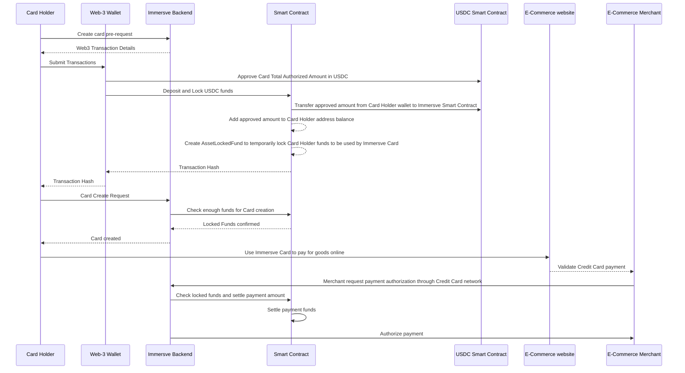

# Immersve Payment Gateway

Contract Module that allows CardHolders to deposit funds and lock them to be able to use them with one time use credit cards.

## Functions

### `initialize`(address payable _settlementAddress, address _usdcSmartContract, uint256 _defaultTimeoutBlocks, uint256 _safetyBlocks) external initializer

> Initialize the Smart Contract with the required arguments
- `_settlementAddress` (type `address payable`): The web3 address were Locked funds will be sent once a payment is confirmed by Immersve
- `_usdcSmartContract` (type `address`): The current network address of the ERC-20 USDC Smart Contract
- `_defaultTimeoutBlocks` (type `uin256`): Number of blocks in the blockchain that an asset lock will last by default
- `_safetyBlocks` (type `uin256`): Number of blocks on top of the default timeout used to calculate if a Lock is usable or not. Because there might be a delay between a transaction confirmation and the actual use of Locked funds by Immersve, there has to be some safety threshold for Immersve to execute the settlement of funds.

-----

### `getVersion()` external pure returns(string memory)

> Get the current version implementation of the smart contract with a Version number stored in a Solidity Constant. This means that the constant is not saved into the Smart Contract store.

-----

### `pause()` public onlyRole(PAUSER_ROLE)

> Pauses the functionality of the Smart Contract. All the functions marked with the `whenNotPaused` modifier will reject the transaction once a pause is in effect. Only the `PAUSER_ROLE` will be able to call this function.

-----

### `unpause()` public onlyRole(PAUSER_ROLE)

> Unpauses the functionality of the Smart Contract. All the functions marked with the `whenNotPaused` modifier will accept the transaction normally. Only the `PAUSER_ROLE` will be able to call this function.

-----

### `setTimeoutBlocks`(uint256 timeoutBlocks) public onlyRole(SETTLER_ROLE)

> Set the default timeout for `AssetLockedFund` as described  in `Asset Locked Funds` section. Only the `SETTLER_ROLE` will be able to call this function.
- `timeoutBlocks` (type `uin256`): Number of blocks for an Asset Lock to be considered expired

-----

### `setSafetyBlocks`(uint256 timeoutBlocks) public onlyRole(SETTLER_ROLE)

> Set the safety block threshold for `AssetLockedFund` as described  in `Asset Locked Funds` section. Only the `SETTLER_ROLE` will be able to call this function.
- `timeoutBlocks` (type `uin256`): Number of blocks for an Asset Lock to be considered safe to settle

-----

### `deposit`(uint256 usdcAmount) external whenNotPaused nonReentrant

> Consumers can deposit USDC funds into the Smart Contract using this function. The funds can either be `locked` or `withdrawn` by the consumer later. Locked funds cannot be withdrawn until the lock expires, or the user revokes the lock with an Immersve token.
```
There is a pre-requisite for this function to work. Because USDC is an ERC-20 token, 
the consumer needs to approve (https://polygonscan.com/token/0x2791bca1f2de4661ed88a30c99a7a9449aa84174#writeProxyContract#F1 USDC funds 
to the Smart Contract public address
```
- `usdcAmount` (type `uin256`): USDC Amount to deposit in `ethers` format

-----

### `depositTo`(uint256 usdcAmount, address sender) external whenNotPaused nonReentrant

> Consumers can deposit USDC funds for a specific address into the Smart Contract using this function. The funds can either be `locked` or `withdrawn` by the consumer later. Locked funds cannot be withdrawn until the lock expires, or the user revokes the lock with an Immersve token.
There is a pre-requisite for this function to work. Because USDC is an ERC-20 token, the consumer needs to [`approve`](https://google.com) USDC funds to the target sender address for the Smart Contract public address
- `usdcAmount` (type `uin256`): USDC Amount to deposit in `ethers` format
- `address` (type `address`): Deposit target address

-----

### `withdraw`(uint256 usdcAmount) external whenNotPaused nonReentrant

> Consumers can withdraw USDC funds associated to their balance from the Smart Contract using this function. Locked funds cannot be withdrawn until the lock expires, or the user revokes the lock with an Immersve token.
- `usdcAmount` (type `uin256`): USDC Amount to withdraw in `ethers` format

-----

### `createLockedFund` (uint256 usdcAmount) external whenNotPaused nonReentrant

> Consumers can put a Lock in place for deposited funds so Immersve can authorize the use of a credit card using those locked funds as collateral.
The locked funds will be represented with a `AssetLockedFund` struct inside the Smart Contract. When created, a timeout will be put in place for this lock based on the default Timeout Blocks (see [])
- `usdcAmount` (type `uin256`): USDC Amount to lock in `ethers` format

-----

### `depositAndCreateLockedFund` (uint256 usdcAmount) external whenNotPaused nonReentrant

> Similar to [*deposit*](/contracts/payment-gateway#deposituint256-usdcamount-external-whennotpaused-nonreentrant) but combined with [*createLockedFund*](/contracts/payment-gateway#createlockedfund-uint256-usdcamount-external-whennotpaused-nonreentrant). This function is doing both the deposit and the lock at the same time to save gas fees.
- `usdcAmount` (type `uin256`): USDC Amount to deposit in `ethers` format

-----

### `depositAndCreateLockedFundFor` (uint256 usdcAmount, address sender) external whenNotPaused nonReentrant

> Similar to [*depositAndCreateLockedFund*](/contracts/payment-gateway#depositandcreatelockedfund-uint256-usdcamount-external-whennotpaused-nonreentrant) but the target address is specified as an argument instead of using `msg.sender`
- `usdcAmount` (type `uin256`): USDC Amount to deposit in `ethers` format

-----

### `confirmLockedFundPayment` (address sender, uint256 price, uint256 lockedFundId) external whenNotPaused nonReentrant onlyRole(SETTLER_ROLE)

> Used by Immersve to confirm the settlement of an Immersve Card payment. This function will check that the specified address has enough locked funds for the specified `lockedFundId` and will transfer the settlement amount (`price`) to the settlement address, specified in the [`initialize`](/contracts/payment-gateway#initializeaddress-payable-_settlementaddress-address-_usdcsmartcontract-uint256-_defaulttimeoutblocks-uint256-_safetyblocks-external-initializer) function.
It can only be called by the SETTLER role
- `sender` (type `address`): CardHolder Address doing a payment requiring locked funds with Immersve
- `price` (type `uin256`): USDC Amount to settle in `ethers` format
- `lockedFundId` (type `uin256`): Matching Locked Fund Id (which is linked to a Card) to settle payment being done with an Immersve Credit Card

-----

### `getAvailableLockedFundsBalance` (address sender)

> Get Available Locked funds for the specified `address`
- `sender` (type `address`): CardHolder Address that already did a funds lock

-----

### `getBalance()` 
> Get the available USDC balance of the `msg.sender` deposited in the Smart Contract. Balance is not the necessarily the same as locked funds as the former are short lived.

-----

### `getSenderBalance` (address sender) 
> Get the available USDC balance of the specified `sender` argument, deposited in the Smart Contract. Balance is not the necessarily the same as locked funds as the former are short lived.
- `sender` (type `address`): CardHolder Address

-----

### `getLockedFunds()` 
> Get the `AssetLockedFund` objects of the `msg.sender`

-----

### `getSenderLockedFunds` (address sender) 
> Get the `AssetLockedFund` objects of the specified `sender` argument
- `sender` (type `address`): CardHolder Address that already locked funds at least once

-----

### `revokeLockedFundMultiSig` (uint256 lockedFundId, uint256 nonce, bytes memory signature) external whenNotPaused nonReentrant
> CardHolders will be able to revoke a fund lock using an Immersve signature. Immersve will first check if the funds is being used for a payment on Immersve backend.
If the funds are free to release, Immersve will sign a message with a nonce only valid for a `lockedFundId` and the funds will be put back into the CardHolder balance
- `lockedFundId` (type `uint256`): Id of the `AssetLockedFund` to be released
- `nonce` (type `uint256`): Nonce provided by Immersve API and matches the `signature`
- `signature` (type `memory`): String signature provided by Immersve API created with a `nonce` to avoid replay calls

-----

### `revokeLockedFund` (address sender, uint256 lockedFundId) external whenNotPaused nonReentrant onlyRole(SETTLER_ROLE)
> Function used by Immersve Backend (only SETTLER role can call this function) to revoke an unexpired lock. This could be done if Immersve detect illegal or malicious activity related to the `sender` and prefers to revoke locked fund ids
- `sender` (type `address`): CardHolder Address that already locked funds with the Smart Contract
- `lockedFundId` (type `uint256`): Id of the `AssetLockedFund` to be released


# Immersve Card E-Commerce Payment Happy Path

- Card Holder locks USDC funds with Immersve Smart Contract
- Card Holder receives a valid Credit Card to be used for E-Commerce transaction from Immersve
- Card Holder uses the Immersve Card to pay for goods purchased on an E-Commerce platform
- Immersve authorizes the payment with Credit Card network once the locked funds are confirmed
- Purchase is confirmed by Immersve and E-Commerce merchant


