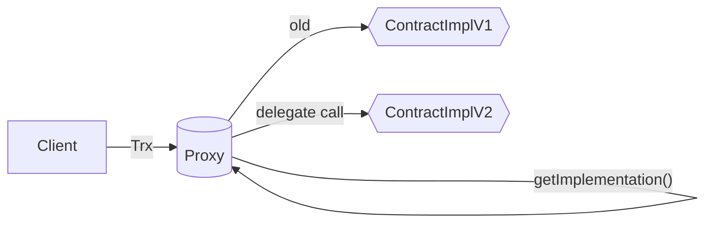
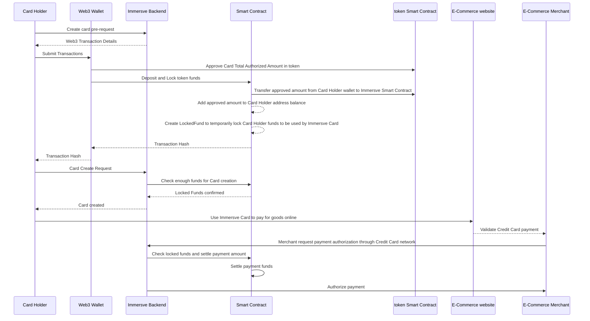

# Immersve Payment Protocol

Contract Module that allows users to deposit and lock funds in order to be able to fund one-time-use Immersve virtual cards.

## Proxy URLs

- Polygon USDC (Mainnet): ***PENDING***
- Polygon Mumbai USDC (Testnet): [0x6993D48098F7E92009306A750b8B82B0E7C2e2A5](https://mumbai.polygonscan.com/address/0x6993D48098F7E92009306A750b8B82B0E7C2e2A5#writeProxyContract)
## Extensions

For security reasons, the smart contract implements the following [OpenZeppelin Contracts](https://docs.openzeppelin.com/contracts/4.x/)

- [Initializable](https://docs.openzeppelin.com/contracts/4.x/api/proxy#Initializable)
- [AccessControl](https://docs.openzeppelin.com/contracts/4.x/api/access#AccessControl)
- [Pausable](https://docs.openzeppelin.com/contracts/4.x/api/security#Pausable)
- [ReentrancyGuard](https://docs.openzeppelin.com/contracts/4.x/api/security#ReentrancyGuard)

## Proxy

The Smart Contract implements the OpenZeppelin [TransparentUpgradeable](https://docs.openzeppelin.com/contracts/4.x/api/proxy#TransparentUpgradeableProxy) proxy. Proxy features:

- **Security**: If any bugs are found, or potential security risks, the Smart Contract can be updated to resolve any potential issues
- **Feature Upgradeability**: Any new features and bug fixes can be added. The Smart Contract will keep the same state, without the need of expensive migrations
- **Stability**: Clients interacting with the Smart Contract will always do so through the same proxy address. The proxy will know the current implementation address and will always keep the same state.

More about upgradeable contracts here: https://blog.openzeppelin.com/the-state-of-smart-contract-upgrades/

## Functions

### `withdraw`(uint `_amount`) `external` nonReentrant notZeroValue(`_amount`) whenNotPaused

> CardHolders can withdraw token funds associated to their balance from the Smart Contract using this function. Locked funds cannot be withdrawn until the lock expires, or Immersve revokes the lock.
- `tokenAmount` (type `uint`): token Amount to withdraw in minor units

-----
### `depositAndLock`(uint `_amount`) `external` nonReentrant notZeroValue(`_amount`) whenNotPaused

> CardHolders can deposit an amount of funds and lock it immediately. This will lock the funds for a number of blocks specified by the `timeoutBlocks` property of the smart contract.
- `_amount` (type `uint`): token Amount to deposit in minor units

-----

### `extendLockedFund`() `external` whenNotPaused

> Allows user to extend his own lock. This operation will fail if there are no locked funds for the wallet initiating the transaction

-----

### `getTimeoutHasPassed` (address _address, uint _additionalBlocks) public view returns (bool)
> Retrieves whether the timeout has passed for the lock owned by the `_address`.

- `_address` (type `address`): CardHolder Address
- `_additionalBlocks` (type `uint`): Optional argument to calculate expiration of a locked fund based on an extra amount of blocks

#### Response
`bool`: `true` if the timeout of the block for `_address` has passed, `false` if the lock is still active

-----
### `getLockedFundBalance` (address _address, uint _additionalBlocks) public view returns (bool, uint)
> Retrieves whether the timeout has passed for the lock owned by the `_address`. Similar to [getTimeoutHasPassed](/contracts/payment-protocol#gettimeouthaspassed-address-_address-uint-_additionalblocks-public-view-returns-bool) but it returns an array indicating if the timeout has passed and the actual balance of the lock for the specified address

- `_address` (type `address`): CardHolder Address
- `_additionalBlocks` (type `uint`): Optional argument to calculate expiration of a locked fund based on an extra amount of blocks

#### Response

`array`: 
- 0 `timeoutHasPassed` (type `bool`): `true` if the timeout of the block for `_address` has passed, `false` if the lock is still active
- 1 `lockedFundBalance` (type `uint`): the balance of the locked fund for the specified address

-----
## Immersve Card E-Commerce Payment Happy Path

- Card Holder locks token funds with Immersve Smart Contract
- Card Holder receives a valid Credit Card to be used for E-Commerce transaction from Immersve
- Card Holder uses the Immersve Card to pay for goods purchased on an E-Commerce platform
- Immersve authorizes the payment with Credit Card network once the locked funds are confirmed
- Purchase is confirmed by Immersve and E-Commerce merchant

