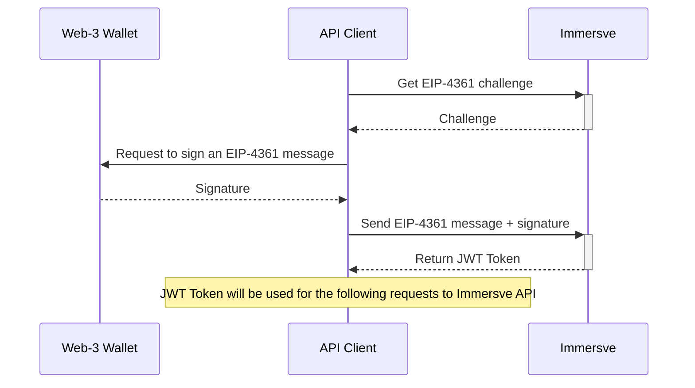

# Authentication

API calls can be authenticated by providing a user access token in the “Authorization” header. Immersve uses [EIP-4361](https://eips.ethereum.org/EIPS/eip-4361) for the sign-in process. The following sections describe the process in detail

### Login Flow



1. [Request EIP-4361 challenge](../api-reference/authentication/generate-challenge). The response is a EIP-4361 message to be signed by the wallet in plain text, for example:

    ```
    app.immersve.com wants you to sign in with your Ethereum account:
    0xA3058369d6A481B1ff08F62B352409c3D709De9b

    Sign in with Ethereum to the app. This request will not trigger a blockchain transaction or cost any gas fees.

    URI: https://app.immersve.com
    Version: 1
    Chain ID: 1
    Nonce: 2hFm7TDbZmerUgnrJ
    Issued At: 2022-08-11T22:29:48.244Z
    ```
    
2. Invoke the wallet's signing capability to get a signature for the challenge message. This part's implementation is specific to the wallet used, but it is fair to say that this abstract function is available in all wallets.
3. [Submit the signed challenge with its signature](../api-reference/authentication/login) to get the authentication token
4. The received token should be used for consequent requests to protected resources in the `Authorization` header