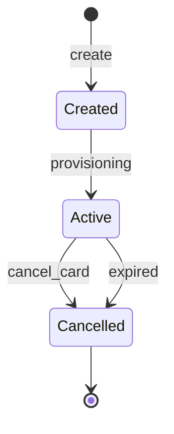

# Card Lifecycle

## Card States

Short-lived virtual cards are activated and ready to use by default. When the card is either expired or cancelled by the user it will transition to the `cancelled` state.

## State Transitions

### Create a card

Call the [create a card](/api-reference/create-a-card) operation to request Immersve generate a card, returning an id.
It is ready to use when a call to [get card details](/api-reference/get-card-details) with the card id returns a payload with status `active`.

### Cancel a card

Should a cardholder change their mind prior to presenting the card to a merchant, cancel the card by calling the [cancel a card](/api-reference/cancel-a-card-asynchronously) operation.
