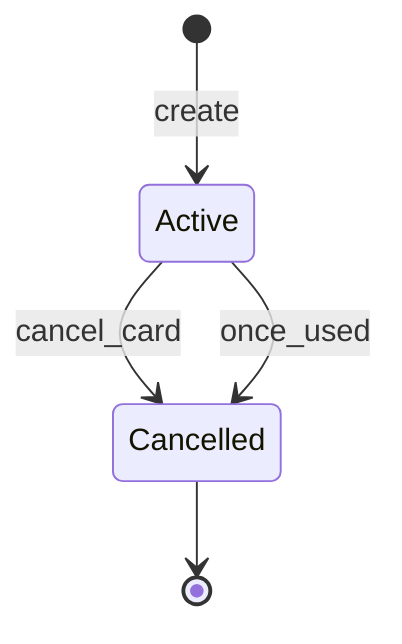

# Card Lifecycle

## Card States

Single-use virtual cards are activated and ready to use by default. When the card is either used to make a purchase or cancelled by the user it will transition to the `cancelled` state.

## State Transitions

### Order a card

A card begins life when you call the [order a card](/api-reference/order-card) operation to request Immersve to generate a card.

### Cancel a card

Should a cardholder change their mind prior to presenting the card to a merchant, you can cancel the card by calling the [cancel a card](/api-reference/cancel-a-card) operation.