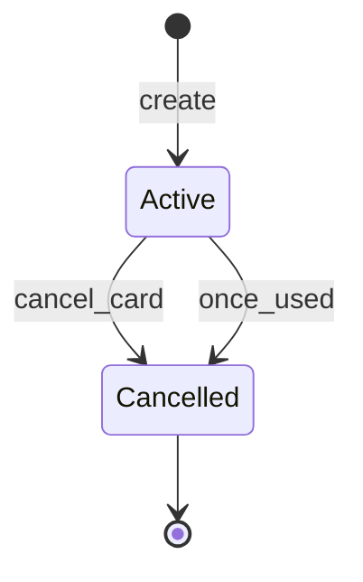
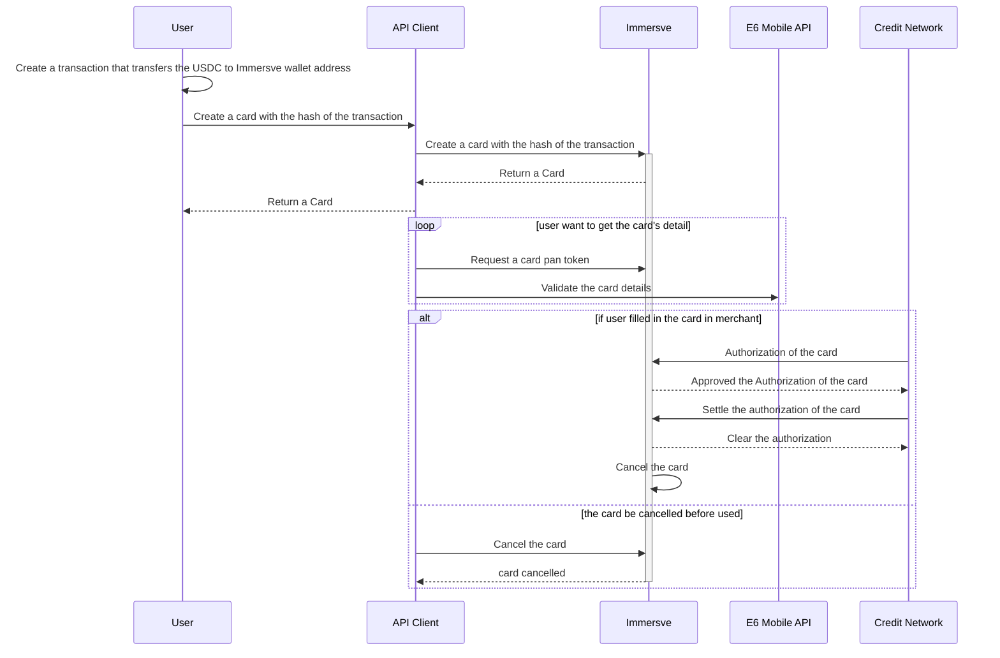

# Card
## Card State
After created, the card is activated. when the card is used or canceled by user, it will go to the cancelled state. 

## Card Usage
1. Before create a card, users need to transfer USDC from their wallet address to Immersve wallet address. 
1. Then they create a card associate with the transaction. Immersve will locked the funds of the transaction in the card for further spending. For security sake, the returned card only include truncated pan and expiry. 
1. To get the full pan and cvv2, users need to:
    1. generate one-time use card PAN token from Immersve using [this API](/api-reference/generate-card-pan-token)
    1. use the token to get the card's details from E6 mobile API
    Example response payload:

```json
{
    "creationTime": 1663888904887,
    "modifiedTime": 1663888904887,
    "id": "1F63FE470D29ABC5C727570C1AD42B82-1000041003",
    "cardNumber": "5713851215688026472",
    "panFirst6": "424211",
    "panLast4": "0528",
    "type": "virtual",
    "state": "activated",
    "sequenceNumber": 1,
    "cardProfileName": "Test card",
    "pinFailCount": 0,
    "reissue": false,
    "expiry": "202409",
    "customerNumber": "10000021250574",
    "embossedName": "CARDHOLDER/IMMERSVE",
    "programName": "vcc",
    "pan": "<the full pan of the card>",
    "cvv2": "<the cvv2 of the card>"
}
```
4. If users authorize a merchant to use the card, credit network will send authorization and clearing request to Immersve, if the transaction are cleared. the card will be cancelled by Immersve automatically.
5. If users change their mind before the card is used, they can cancel the card by calling cancel card API. 


