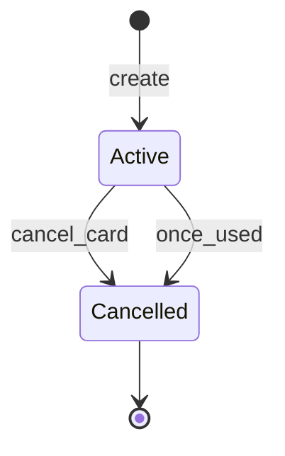
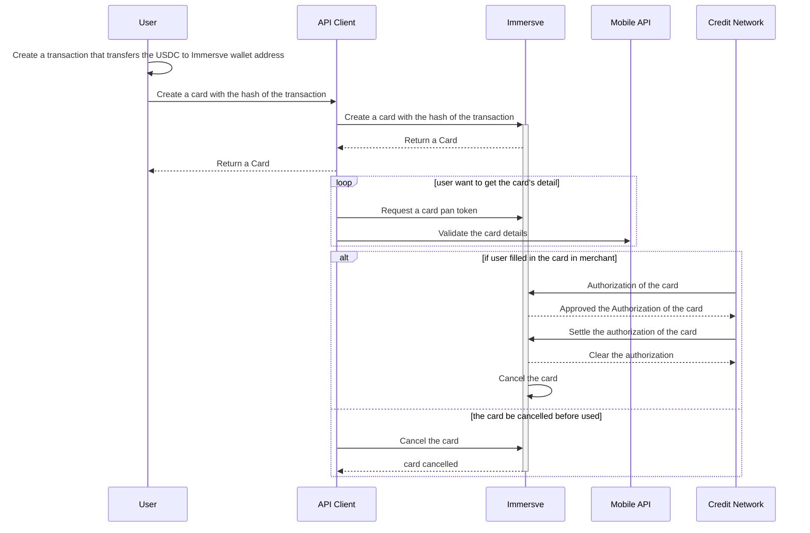

# Creating a Virtual Card
A virtual card is a payment card that exists only in digital form. As such, virtual cards are most suitable for online e-commerce purchases as opposed to in-store purchases at brick-and-mortar merchants. Immersve treat virtual cards as being logically time-bound and ephemeral. Beginning at the time of issuance of a virtual card, it has a finite useable lifespan which is often represeted within the UI of the issuing client application as a stopwatch-type timer. This model presents certain benefits over a traditional persistent payment card model (be they virtual, tokenized or physical) in that the potential for card fraud is dramatically reduced. The use of web3-native authentication mechanisms within the context of card issuance means that 

## Prerequisite Steps
Prior to being permitted to [order a card](/api-reference/order-card) a user must first have successfuly [authenticated](/guides/authentication) and locked digital assets within the smart contract via [digital asset transfer and smart contract invocations](/api-reference/get-prerequisite-transactions).

### Authentication
The authentication processes is described in the [authentication guide](/guides/authentication). As the user account is anchored by control of the private key, there is no distinct prior explicit registration or signup process needed before authenticating.

### Currency conversion
A user will more often than not be quoted a price for a purchase from a merchant in a fiat currency. In order to determine the sufficient amount of digital assets to fund a card and be made available for the purchase, you will retrieve the amount in the digitial asset from the [currency conversion](/api-reference/currency-convert) API endpoint.

### Lock Funds
In order to ensure that funds are sufficiently locked such that Immersve are in a position to approve an authorization requeset received via the card scheme network you will need to obtain the necessary [digital asset transfer and smart contract invocations](/api-reference/get-prerequisite-transactions). The necessary blockchain transactions are contained within the `requiredTransactions` collection.

If the user has not transacted using the solution before then the the [get prerequisite transaction](/api-reference/get-prerequisite-transactions) response will typically call for and `erc20_approval` in favour of the smart contract followed by a `depositAndCreateLockedFund` invocation of the smart contract.

If multiple transactions are present then they should be carried out in the order in which they are presented.

The client application is to parse and formulate the (often JSON-RPC unique to the wallet and/or blockchain) such that it is presented to the user and signed and sent to the relevant

## Order a Card


## Card State
Upon creation a card is activated. Single use virtual cards are    when the card is used or canceled by user, it will go to the cancelled state. 

## Card Usage
1. Prior to creating a card, users must transfer the relevant digital asset from their wallet address to Immersve smart contract address. 
1. Then they create a card associate with the transaction. Immersve will locked the funds of the transaction in the card for further spending. For security sake, the returned card only include truncated pan and expiry. 
1. To get the full PAN and CVV2 pan and cvv2, users need to:
    1. generate one-time use card PAN token from Immersve using [this API](/api-reference/generate-card-pan-token)
    1. use the token to get the card's details from mobile API
    Example response payload:

```json
{
    "creationTime": 1663888904887,
    "modifiedTime": 1663888904887,
    "id": "1F63FE470D29ABC5C727570C1AD42B82-1000041003",
    "cardNumber": "5713851215688026472",
    "panFirst6": "424211",
    "panLast4": "0528",
    "type": "virtual",
    "state": "activated",
    "sequenceNumber": 1,
    "cardProfileName": "Test card",
    "pinFailCount": 0,
    "reissue": false,
    "expiry": "202409",
    "customerNumber": "10000021250574",
    "embossedName": "CARDHOLDER/IMMERSVE",
    "programName": "vcc",
    "pan": "<the full pan of the card>",
    "cvv2": "<the cvv2 of the card>"
}
```
4. Assuming that the user presents the card at a merchant, authorize a merchant to use the card, credit network will send authorization and clearing request to Immersve, if the transaction are cleared. the card will be cancelled by Immersve automatically.
5. Should a user change their mind prior to presenting the card to a merchant, they can cancel the card by calling [cancel card](/api-reference/cancel-card) operation. 


