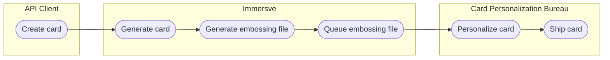

# Card Lifecycle

The lifecycle of a card is tracked via a set of predefined card states. Throughout the card lifecycle the current state is used to determine the capabilities of the card. For example, cards must be activated before they can be used for purchases or other such activity.

Immersve manages the lifecycle of cards, acting upon inputs from clients and other connected systems whilst ensuring that only permitted state transitions are carried out.

:::note
Card blocks are a distinct concept from the card lifecycle states
:::

## Introduction

As soon as a card is created it will be default to the `created` state. Depending on the type of card that was created it might be moved into different states automatically at this point.

Card state updates can be made at any time once a card is created. The most common instances of card state updates include:

- Card activation in order to make the card ready for use
- Card deactivation once the card is no longer needed

Card state updates are performed using the Update Card State API. A state must be provided in the request and a memo can optionally be included.

Certain card state transitions are carried out automatically without explicit API client interactions. These circumstances include when a physical card moves from `created` to shipped once the card embossing file has been generated for that card.

## Card States

| State     | Description                                              |
| --------- | -------------------------------------------------------- |
| created   | Card record has been created                             |
| shipped   | Card has shipped to the manufacturer for production.     |
| sold      | Card has been sold, typically at a point-of-sale (POS).  |
| returned  | Card has been returned to the banking institution.       |
| resent    | Card has been resent to the customer's address.          |
| activated | Card is activated and ready for use.                     |
| invalid   | Card is no longer valid and is blocked from further use. |

## State Transitions

The following diagram shows the lifecycle of a card's different states.

```mermaid
stateDiagram-v2
    [*] --> Created: start
    Created --> Activated:
    Created --> Shipped:
    Created --> Invalid:
    Shipped --> Returned:
    Shipped --> Activated:
    Shipped --> Sold:
    Shipped --> Invalid:
    Returned --> Resent:
    Returned --> Invalid:
    Resent --> Returned:
    Resent --> Sold:
    Resent --> Activated:
    Resent --> Invalid:
    Sold --> Activated:
    Sold --> Invalid:
    Activated --> Invalid:
    Invalid --> [*]: end
```

## Virtual cards

### Card activation

A virtual card is `activated` automatically upon creation and no eplicit interactions are required prior to the usage of the card.

## Physical cards

A card represents a collection of data including primary account number (PAN), expiry date, and security code, that allows a cardholder to make card payments. A physical card is an object that is encoded with unique card data during manufacture and is delivered to a cardholder. Physical cards let cardholders hold the data pertaining to their card on their person.

Immersve supports physical card issuance and manufacture via the card creation API operation. Immersve do not ourselves produce physical cards; rather we integrate with card manufacturers who handle physical card production, personalization and shipping. As a client, you can request to create a physical card using the Immersve APIs. Immersve then includes the particulars of the newly-created card within an embossing file and sends it to your chosen card manufacturer partner for personalization.



### Shipped / Returned / Resent / Sold

Transitions to `shipped`, `returned`, `sold` and `resent` states are determined by the data prodived by the card personalization bureau.

### Card activation

Card activation must be done before a card is able to be used for card payments or other functions. To activate a card, set the state in the request to activated. For security reasons, a physical card cannot be moved from created to activated. Instead, it can only be activated after it is `sold` or `shipped`. Card activation ensures that the details of a physical card cannot be used until it is delivered to the customer and `activated`.

You can alternatively activate a card by setting the card Personal Identification Number (PIN) for the first time.

## Card deactivation

Once a card is no longer needed, the card can be deactivated. When a card is deactivated, a card block is created on the card so that it can no longer be used. To deactivate a card, set the state in the request to `invalid`. Once a card has been set to `invalid`, it can no longer be transitioned to another state.

You can cancel the card by calling the [cancel a card](/api-reference/cancel-a-card-asynchronously) operation.

You can alternatively deactivate a card by selecting the option when reissuing a card. For more information, see Card Orders.
