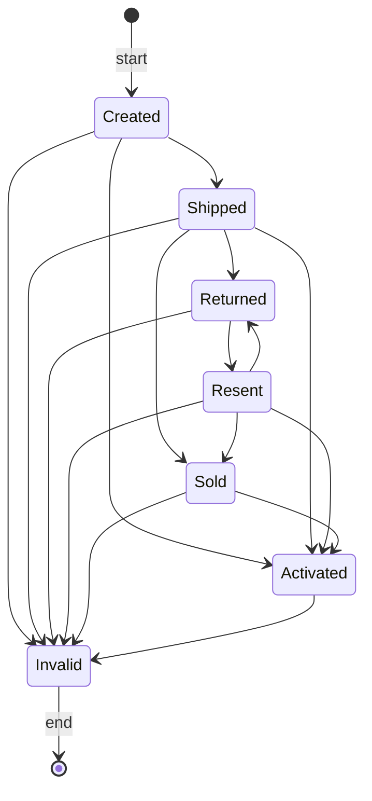
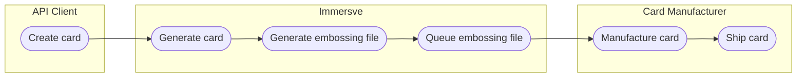

# Card Lifecycle

The lifecycle of a card is tracked via a set of predefined card states. Throughout the card lifecycle the current state is used to determine the capabilities of the card. For example, cards must be activated before they can be used for purchases or other such activity.

Immersve manages the lifecycle of cards, acting upon inputs from clients and other connected systems whilst ensuring that only permitted state transitions are permitted.

:::note
Card blocks are a distinct concept from the card lifecycle
:::

## Prerequisites
Before managing the card state, the card must first be created by placing a card order. For more information, see Card orders. As soon as a card is created, it will be defaulted to the created state. Depending on the type of card profile that was used to create the card, it can be moved into different flows automatically.

Actions
Card state updates can be made at any time once a card is created. The most common instances include of card state updates include:

* Card activation in order to make the card ready for use
* Card deactivation once the card is no longer needed
* Card state updates are performed using the Update Card State API. A state must be provided in the request and a memo can optionally be included.

Certain card state transitions are carried out automatically without . These circumstances include when a physical card moves from `created` to shipped once the card embossing file has been generated for that card.

## Card States

 
| State | Description |
| ---- | ---- |
| created |Card record has been created |
| shipped |Card has shipped to the manufacturer for production. |
| sold |Card has been sold, typically at a point-of-sale (POS). |
| returned |Card has been returned to the banking institution. |
| resent | Card has been resent to the customer's address. |
| activated |Card is activated and ready for use. |
| invalid |Card is no longer valid and is blocked from further use. |

### Created

### Shippped

### Sold

### Returned

### Resent

### Activated

### Invalid

## State Transitions

The following diagram shows the lifecycle of a card's different states.

## Virtual cards

## Physical cards

Card activation
Card activation must be done before a card is able to be used for card payments or other functions. To activate a card, set the state in the request to activated. For security reasons, a physical card cannot be moved from created to activated. Instead, it can only be activated after it is sold or shipped. Card activation ensures that the details of a physical card cannot be used until it is delivered to the customer and activated.

You can alternatively activate a card by setting the card Personal Identification Number (PIN) for the first time. For more information, see Card PINs.
You can activate a card using the Dashboard.

Card deactivation
Once a card is no longer needed, the card can be deactivated. When a card is deactivated, a card block is created on the card so that it can no longer be used. For more information, see Card blocks. To deactivate a card, set the state in the request to invalid. Once a card has been set to invalid, it can no longer be transitioned to another state.

You can alternatively deactivate a card by selecting the option when reissuing a card. For more information, see Card Orders.
Other card states
A card can be transitioned to various card states using the same Update Card State API. Other card states are commonly used when managing card stocks outside of the E6 platform. See the appendix for other card state definitions.

What's next
Once a card is activated, you can validate the card and its cardholder by using calls from the Customers API. The process of activating a card is largely dependent on the partner's individual requirements. With an activated card, a customer is able to make purchases or perform other card-based functions. You can read more about card purchases in Card payments.

Appendix: Card states
 
| STATE | DESCRIPTION |
| ---- | ---- |
| created |Card has been created in the database. |
| shipped |Card has shipped to the manufacturer for production. |
| sold |Card has been sold, typically at a point-of-sale (POS). |
| returned |Card has been returned to the banking institution. |
| resent | Card has been resent to the customer's address. |
| activated |Card is activated and ready for use. |
| invalid |Card is no longer valid and is blocked from further use. |

## State Transitions

### Virtual cards

A card begins life when you call the [order a card](/api-reference/order-card) operation to request Immersve to generate a card.

### Physical cards

Should a cardholder change their mind prior to presenting the card to a merchant, you can cancel the card by calling the [cancel a card](/api-reference/cancel-a-card) operation.