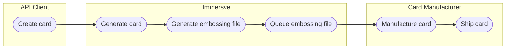

# Physical cards

A card represents a collection of data including primary account number (PAN), expiry date, and security code, that allows a cardholder to make card payments. A physical card is an object that is encoded with unique card data during manufacture and is delivered to a cardholder. Physical cards let cardholders hold the data pertaining to their card on their person. 

Immersve supports physical card issuance and manufacture via the card creation API operation. Immersve does not ourselves produce physical cards; rather we integrate with card manufacturers who handle physical card production and shipping. As a client, you can request to create a physical card using the Immersve APIs. Immersve then includes the particulars of the newly-created card within an embossing file and sends it to your chosen card manufacturer partner.

The physical card order flow is as shown in the following diagram.

[Contact us](https://immersve.com/#contact) to find out if your preferred card manufacturer can be supported.

To see if your preferred regional manufacturer has been integrated with Immersve, contact your Immersve representative.
Prerequisites
Immersve must be securely integrated with the card manufacturing partner in order to provide card embossing files. Immersve integrates with card manufacturers by registering the manufacturer as a partner and issuing access credentials for their system.

Typical steps to get set up with a card manufacturer include:

1. Create card designs
1. Acquire approval from your card network
1. Produce blank card plastic
1. Create card collateral

Stock levels are not managed or recorded as part of the Immersve physical card orders process. For information on stock levels, work with your card manufacturer.
To place a physical card order with Immersve, a program with a card profile is required. Align your card manufacturing profile to a physical card issuance profile in the Tritium platform. For physical cards, the card profile should have the card type field set to Personalized or Temporary. Physical cards also required a service code to be set by the card profile. For more information about creating a card profile, see Card profiles.

Actions
Immersve allows you to manage physical cards by creating a card through the API and track card states.

, and sending a card order file to card manufacturers.

Placing a physical card order
You can order an individual physical card with the Card Orders API and the Immersve Dashboard. For more information on this process, see Card orders. When a card is ordered, it will be created according to the specifications defined by the card profile. You can also place a card order in the Dashboard.

When a card order has been placed, information about the ordered card will be added to your embossing file. This file is then sent to your card manufacturer.

## Physical card order fulfillment
After you complete a physical card order, Immersve generates a file containing all the information required for the cards to be produced. The ordered cards are included in the file. The embossing file supports orders for individual cards as well as bulk card orders. The embossing file consists of two parts: information about the entire order, contained in the cards object, and information about all the cards in the order, contained in the cards object.

Order information
A single embossing file can contain multiple card orders within the orders object. Each card order in the file can include the following information:

The embossing file is sent to card manufacturers once per day. Each file includes all cards that have been created since the last time the file was generated. The embossing file can also be sent in batches.

When your card manufacturer receives the embossing file, the cards will be produced according to the order information in the file. When the cards have been produced, they will be shipped to your customers or specified branch locations.

A sample embossing file and a description of the fields in the JSON file can be found the in the Appendix of this document.

## Physical card shipping
Physical card shipping will be managed by the card manufacturer. When an order for a physical card has been placed, it typically goes through the following sequence of card states:

After the card order has been placed and the card is created in the database, its state is `created`.
When the card order information has been sent to the card manufacturer, its state changes to `shipped`.
If the card is returned before reaching the customer, its state changes to `returned`.
If a Point-of-Sale (POS) has been configured and the card is sold at a POS, its state changes to `sold`.
If the card is being resent to the customer address, its state changes to `resent`.
When the card is activated and ready to be used, its card state changes to `activated`.
If the card is deactivated, its card state changes to `invalid`.

What's next
When a physical card has been shipped from the manufacturer, its state will need to change to activated before it can be used. For more information about activating a card, see Card state management.

A card PIN also needs to be set once a physical card has been ordered. Setting the card PIN for the first time will activate the card automatically. For more information, see Card PINs.
