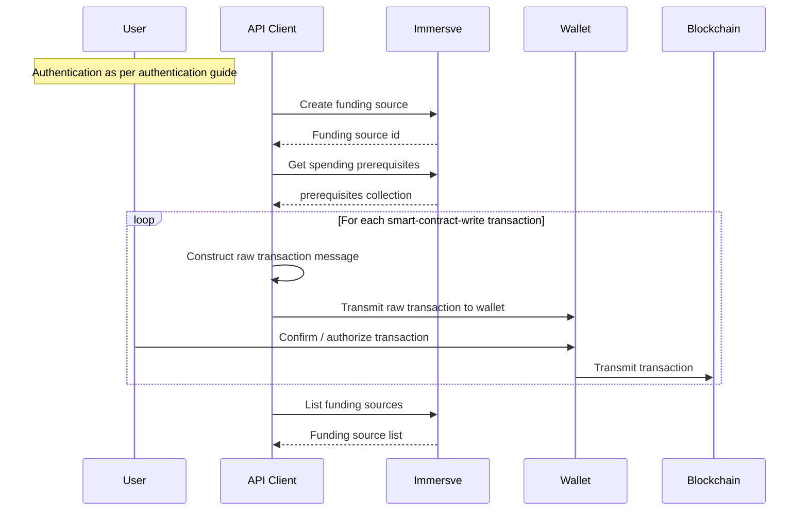

# Funding Card Spending

To create and spend using a card, a funding source must be created.
A funding source is an account that connects a user's funds to a card and the card network.
It is a prerequisite of card creation that a funding source must be explicitly provisioned for a user.
Multiple cards can be provisioned for the same funding source.

## Non-custodial funding

For non-custodial user's the funding source maintains a ledger balance of both on-chain and card network transactions. 

It is important to note that it is the funding source that maintains the balance of available funds against which a card may transact. This allows users to manage funds independently of managing cards.  
A user should ensure that a funding source has sufficient balance before attempting to authorize transactions with an affiliated card.

If multiple cards are created against the same funding source they all have access to the balance maintained on it.

## Authentication

The authentication processes are described in the [authentication guide](/guides/authentication).

## Funding Source Provisioning

A funding source is created by a request to the [claim a funding source for an account](/api-reference/claim-a-funding-source-for-an-account) endpoint.
The funding wallet may be an EOA or a smart contract implementing the ERC-1271 interface.

## Funding Process

On-chain funding can be done at any time regardless of card or funding source provisioning.
A funding source can be loaded with digital assets without using Immersve APIs by depositing funds directly to our smart contract.

However, our APIs aim to reduce the complexity of determining what is the amount of digital assets needed to meet a users desired spend in their desired fiat currency. They also provide pre-built `smart-contract-write` transactions for successful interactions with the Immersve smart contract.

### Currency Conversion

A user may be quoted a price for a purchase by a merchant in a local fiat currency. To determine the sufficient amount of local fiat currency to fund a card in its billing currency (USD), use the [currency conversion](/api-reference/currency-conversion) API endpoint.

The returned value can passed to the get spending prerequisites endpoint as detailed below.

### Lock Funds

To ensure that funds are sufficiently locked within the [smart contract](/contracts/payment-protocol) such that Immersve are in a position to approve an authorization request received via the card scheme network you will need to have first locked sufficient digital assets within the smart contract via digital asset transfer and smart contract invocations as instructed by the [get spending prerequisites](/api-reference/get-spending-prerequisites) operation. The necessary blockchain transactions are contained within the `prerequisites` collection returned.

If the user has not transacted using the solution before then the [get spending prerequisites](/api-reference/get-spending-prerequisites) response will typically call for an ERC20 `approve` in favour of the smart contract followed by a `depositAndLock` invocation of the smart contract.

If multiple transactions are present then they should be carried out in the order in which they are presented.

The client application is to parse and formulate the raw blockchain transaction message such that it is presented to the user within the web3 wallet and signed and sent to the relevant blockchain.

#### How to use prerequisites example for ts/js

The [get spending prerequisites](/api-reference/get-spending-prerequisites) endpoint returns an array of both regulatory and smart contract prerequisite transactions.  
Each object in the array has `type` and `params`.  
Type `smart_contract_write` means that this action is about interaction with the smart contract. `params` contains all the details required to perform this interaction.

<details>
<summary>Code snippet (using ethers.js)</summary>

Typescript code

```ts
const { abi, contractAddress, method, params } =
  response.data.prerequisites.params;

const contract = new Contract(contractAddress, abi, signer); // third param Signer is required

const { hash } = await contract[method](...Object.values(params));
```
</details>

### Wallet Funding for Development and Testing

To ensure that integrators can obtain sufficient ERC-20 tokens to facilitate development and testing, Immersve uses an ERC-20 token contract that allows tokens to be freely minted as needed.

In non-production environments, any transaction returned by [get spending prerequisites](/api-reference/get-spending-prerequisites) with actions related to ERC20 smart contract will refer to the "IMMUSDC" token. The "IMMUSDC" token has a `mint` function allowing for the unlimited minting of the token to any wallet address.

One particularly convenient way to get the necessary tokens is to use the Polygonscan interface.

- Open the [IMMUSDC token in Polygonscan](https://mumbai.polygonscan.com/address/0x2FaC06acFAeB42CC3B5327fcF53F48D9Da72749d#code)
- Click `Write as Proxy`
- Click `Connect to Web3` to connect your wallet with Polygonscan
- Open the `mint` function
- Set the destination wallet address (where assets are to be sent) in the `to` field. Set an amount in the `amount` field.
- Initiate the web3 transaction by clicking the `Write` button
- Confirm the transaction in the web3 wallet and pay the gas fees

### Funding Sequence Diagram


