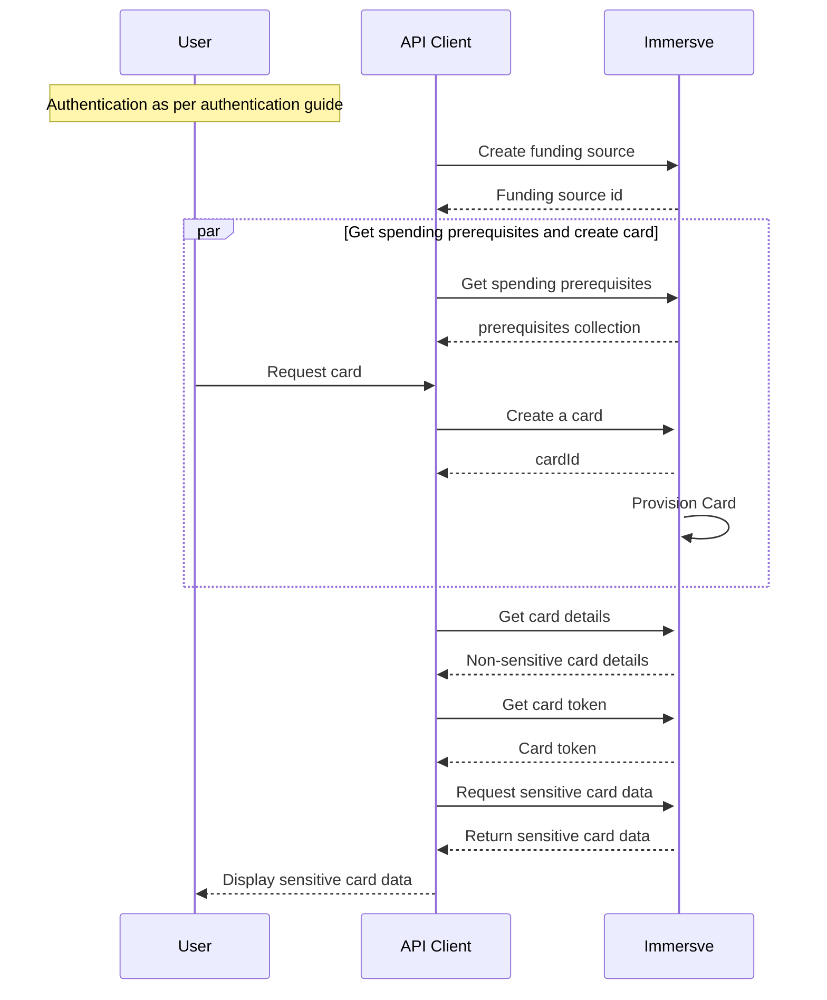

# Issue a Virtual Card

A virtual card is a payment card that exists only in digital form. As such, virtual cards are most suitable for online e-commerce purchases as opposed to in-store purchases at brick-and-mortar merchants. By default virtual cards are logically time-bound and ephemeral. Beginning at the time of issuance of a virtual card, it has a finite useable lifespan which is often represented within the UI of the issuing client application as a stopwatch-type timer. This model presents certain benefits over a persistent payment card model (be they virtual, tokenized or physical) in that the potential for card fraud is dramatically reduced.

Prior to being permitted to [create a card](/api-reference/create-a-card) a user must first have successfully [authenticated](/guides/authentication) and fulfilled any regulatory prerequisites as instructed by the [get spending prerequisites](/api-reference/get-spending-prerequisites) operation.

## Authentication

The authentication processes is described in the [authentication guide](/guides/authentication). As the user account is anchored by control of the private key, there is no distinct prior explicit registration or signup process needed before authenticating.

## Provision Funding Source

A funding source is required for card creation. Besides this requirement, cards and funding sources are managed independently.
See [Claim a funding source for an account](/api-reference/claim-a-funding-source-for-an-account) and the [Funding Card Spending](/guides/funding-card-spending) guide.
## Create a card

Call the [create a card](/api-reference/create-a-card) operation to request Immersve to generate a card.

If successful a [create a card](/api-reference/create-a-card) request will return a card id. Immersve will provision and activate the card by default. 
It is provisioned and activated when the [get card details](/api-reference/get-card-details) response payload includes a `status` of `active`. 
All cards are currently short-lived and the time to expiry begins at the time of activation, the expiry timestamp is returned in the `immersveExpiration` field.
## Issue a Card

Having created a virtual card via the [create a card](/api-reference/create-a-card) operation and confirmed it is `active`, you are in a position to be able to obtain the sensitive card details to be presented to the cardholder.

There are two steps in this process;

1. firstly, obtaining a token for transmission to the client application to which the card details are to be provided (i.e. the application that will display the card data to the cardholder) and;
2. secondly, the exchange, by that client application, of the token for the card data.

:::note
It is not recommended that the card token is supplied to any application other than one that resides within the cardholder environment (i.e. their mobile application or web application running in their browser) unless that system is sufficiently compliant with PCI-DSS requirements and is audited as such.
:::

### Get a Card Token

Generate a single-use card `token` using [the get a card token](/api-reference/get-a-card-token) operation. The token is typically then transmitted to the cardholder's environment (i.e. web application or mobile application running in their web browser) to complete the final step completing the card issuance.

### Get Sensitive Card Details

To obtain the full PAN and CVV2 for display to the cardholder your client-side application should exchange the token for the sensitive card data. See [fetching secure card information](/guides/fetching-secure-card-information).

## Virtual Card Issuance Sequence Diagram

