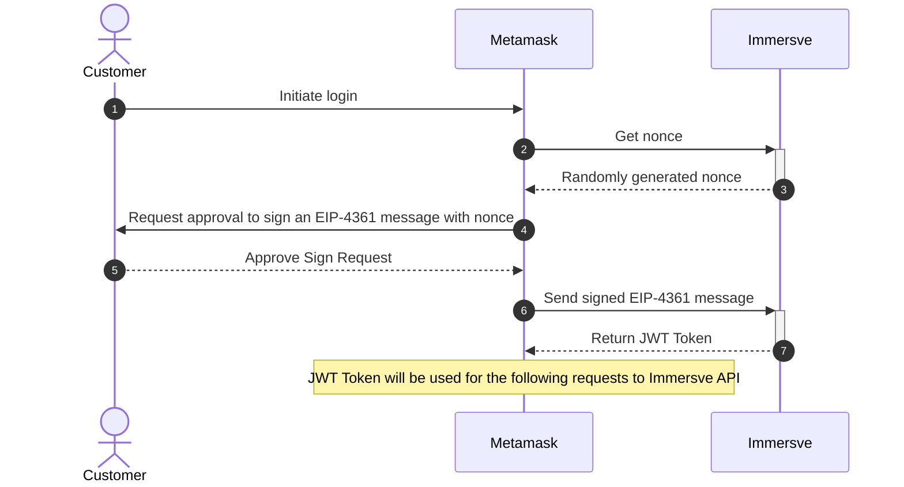
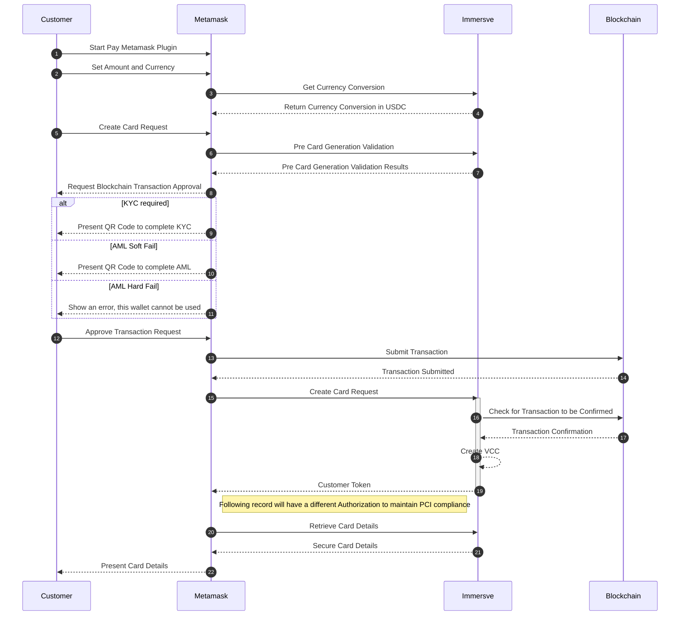

# MetaMask Integration

### Notes

User funding/login wallet (must be a USDC polygon wallet)

# User Flows

### Login Flow



1. Request a nonce
    
    **GET /api/siwe/nonce**
    
    will return a random nonce value as a plain text that will also be stored in the session
    
2. Create [SIWE message](https://docs.login.xyz/sign-in-with-ethereum/quickstart-guide/creating-siwe-messages) using the nonce
3. Submit a signed challenge with the wallet information
    
    **POST /api/siwe/login**
    
    Request:
    
    ```json
    {
    	"message": "app.sb1.lol wants you to sign in with your Ethereum account:\n0xA3058369d6A481B1ff08F62B352409c3D709De9b\n\nSign in with Ethereum to the app. This request will not trigger a blockchain transaction or cost any gas fees.\n\nURI: https://app.sb1.lol\nVersion: 1\nChain ID: 1\nNonce: 2hFm7TDbZmerUgnrJ\nIssued At: 2022-08-11T22:29:48.244Z",
    	"signature": "0xbf..."
    }
    ```
    
    Response:
    
    ```json
    {
    	"user": {
    		"id": string, // user id in Immersve
    		"walletAddress": string
    	},
    	"token": string //JWT token>
    }
    ```
    

### Payment Flow



## Authentication

1. To call Immersve API
    1. Authenticate user web3 wallet against Immersve dApp with a sign challenge
    
    After the challenge is signed, the client will receive a JWT token signed by Immersve. This token will represent the user credentials on Immesrve backend
    
    1. To fetch card details
    2. A token will be issued to MetaMask to call card details API

## Generating Card

1. Get list of currencies that we support for currency conversion call. Immersve should put cache control on this
2. USDC to currency conversion (including estimated gas fee), this is estimate only:

**GET /currency/convert**?target={targetCurrencySymbol}&currency={sourceCurrencySymbol}&amount={amountToConvert}

Response:

```json
{
	"sourceCurrency": "NZD",
	"targetCurrency": "USDC",
  	"sourceAmount": 500,
  	"targetAmount": 320.22,
	"expiresIn": "2022-01-01 00000 UTC", //TODO: check currency conversion API from Mastercard
	"rate": 1.5,
	"fees": [{
			"type": "gas",
			"amount": 2.50,
			"currency": "USDC"
		},
		{
			"type": "conversion_fee",
			"amount": 5,
			"currency": "NZD"
		}
	]
}
```

1. Check if new Card generation is allowed

Sometimes, the creation of a new card won’t be allowed:

- KYC is required
- AML hard reject (user wallets is black listed)
- AML soft reject (user needs to provide more details on the source of funds)

**POST /card/generation-check**

Body:

```json
{
	"chainID": 137, // for now, just the Polygon network
	"address": "0x3131232", // actual wallet where the user will pay from
	"amount": {
		"total": 320.22, // amount in USDC
		"buffer": 0.1, // (optional) extra buffer to be sure that the transaction will go through
		"currency": "USDC", // we will always use USDC, but we might want to use something else in the future, so this could be optional
	},
  "reference": "0asd3as21d" //TODO: check if we should send a reference back
}
```

**200 - Response Successful**

User is allowed to generate a new card. Client should be able to request a transaction from the user wallet to Immersve wallet

```json
{
	"status": "authorized",
	"targetWallet": "0x031231", // Immersve wallet. This can be useful if we need to change the wallet in the future
	"amount": { // authorized amount, anything higher than this will be rejected later (except for the buffer)
		"total": 320.22, // amount in USDC
		"buffer": 0.1, // (optional) extra buffer to be sure that the transaction will go through
		"currency": "USDC", // we will always use USDC, but we might want to use something else in the future, so this could be optional
	}
}
```

**401 - Unauthorized**

User is not logged in, or the authentication token is expired. Will need to re-login

Response:

```json
{
	"status": "unauthorized",
	"reason": "NOT_LOGGED_IN",
	"actionUrl": "https://immersve.com/user/web3/login" //TODO
}
```

403 - Forbidden operation //TODO: is 403 the right status code?

**User needs KYC**

When the user reaches a certain amount spent in the platform, Immersve will require them to provide some identification information to comply with regulatory entities

Response:

```json
{
	"status": "error",
	"reason": "KYC_REQUIRED",
	"actionUrl": "https://immersve.com/kyc/start?userId={immersve-userId}" //TODO
}
```

**AML Checks Failed**

Immersve AML Provider found that the funding wallet might not comply with AML and can’t check the origin of funds for the provided wallet. User will need to go through AML process to validate the source of the funds on the wallet

TODO: define scenarios for hard and soft AML blocks

Response:

```json
{
	"status": "error",
	"reason": "AML_CHECK_FAILED", //TODO: do we want to reveal this
	"actionUrl": "https://immersve.com/aml/start?userId={immersve-userId}&wallet={fundingWallet}" //TODO: anything we can do here?
}
```

1. Generate new Card endpoint

**POST /card/**

Body:

```json
{
	"source": "MetaMask", //MetaMask needs to ensure this is correct as this will be used to identify transactions triggered from MetaMask
	"type": "vcc",
	"amount": {
		"total": 320.22, // amount in USDC
		"buffer": 0.1, // (optional) extra buffer to be sure that the transaction will go through
		"currency": "USDC", // we will always use USDC, but we might want to use something else in the future, so this could be optional
	},
	"transactionHash": "TODO: asdf", //for Immersve to check fund transfer on chain
	"chainID": 123,
	"returnSurplus": true, //indicate whether the suplus fund will be returned to the card holder
}
```

Note: Not part of MVP, but going forward we may add a wallet address as optional parameter in case wallet used to login is different from funding wallet. TODO, make the design flexible

Response:

**200 - Successful card creation**

```json
{
	"cardToken": "xyz", //the token used to fetch card details
	"expiry": "2022-01-01 1111111UTC" //if a value that is earlier than the card expiry date on the card details, this value is when the card will actually expire instead of the expiry date on the card details
}
```

**401 - Unauthorized**

User is not logged in, or the authentication token is expired. Will need to re-login

Response:

```json
{
	"status": "unauthorized",
	"reason": "NOT_LOGGED_IN",
	"actionUrl": "https://immersve.com/user/web3/login" //TODO
}
```

**403 - Forbidden operation** //TODO: is 403 the right status code?

**User needs KYC**

When the user reaches a certain amount spent in the platform, Immersve will require them to provide some identification information to comply with regulatory entities

Response:

```json
{
	"status": "error",
	"reason": "KYC_REQUIRED",
	"actionUrl": "https://immersve.com/kyc/start?userId={immersve-userId}" //TODO
}
```

**AML Checks Failed**

Immersve AML Provider found that the funding wallet might not comply with AML and can’t check the origin of funds for the provided wallet. User will need to go through AML process to validate the source of the funds on the wallet

TODO: define scenarios for hard and soft AML blocks

Response:

```json
{
	"status": "error",
	"reason": "AML_CHECK_FAILED", //TODO: do we want to reveal this
	"actionUrl": "https://immersve.com/aml/start?userId={immersve-userId}&wallet={fundingWallet}" //TODO: anything we can do here?
}
```

## Getting Card Secure Details

Get [external.immersve.com/cards/details](http://external.immersve.com/cards/details) //TODO: decide URL

For the purpose of filling in ecom payment page.

Response

```json
{
	"cardNumber": "4111111111111111",
	"cvv2": "123",
	"expiry": "202706", 
	"name": "Immersve Mastercard"
}
```

## Cancel card

TODO

### Potential APIs

1. refresh tokens API

### TODO:

1. assumptions
    1. Currency conversion displays is estimation only
    2. allow anyone to transfer fund to Immersve wallet (what if there are funds that are not legit fund for generating cards?)
2. KYC/AML flows
3. Edge cases 
    1. around currency conversions
4. Book security review with Marco
    1. Authentication
    2. Secure way to share Immersve wallet address with MetaMask
5. Do we allow unintended deposit to Immersve wallet, for example
    1. a user trying to deposit an amount larger than what’s allowed without KYC
    2. a hacker decided to deposit say 1b into Immersve wallet
6. to do
    1. cases on surplus/buffer of fund transfer to Immersve wallet (default value for MVP?)
        1. how do we handle the transfer back to the user say when the amount of surplus is less than the gas fee that is required for transfer
        2. we need to keep track of those transfers and records and running totals
    2. timing requirements on getting card details, 1 or 2 calls to E6 to get card token
    
    1. currency conversion lock-in mechanism, or would the currency displayed just indication only (with disclaimer)
        1. 
        
        
        

What should happen in the case of timeout?