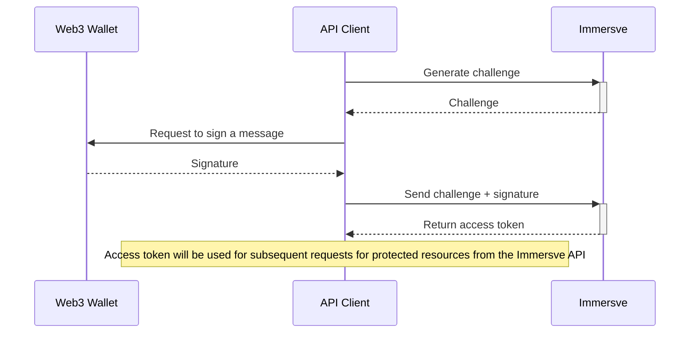

import ethers from "ethers";
import axios from "axios";
import TOCInline from "@theme/TOCInline";
import CodeBlock from "@theme/CodeBlock";

# Authentication

Accounts are identified by way of blockchain addresses. Proof of ownership of an address is based upon a process of authentication by way of verification of [EIP-4361](https://eips.ethereum.org/EIPS/eip-4361) challenges signed by the private key underlying an address. Upon successful authentication, Immersve will issue an access token for subsequent use in interactions with the Immersve API.

Subsequent requests for protected resources from the Immersve API may be authenticated by supplying the access token in the `Authorization` header.

### Login Flow



1. [Generate a challenge](/api-reference/generate-challenge). The response is an [EIP-4361](https://eips.ethereum.org/EIPS/eip-4361) message in plain text to be signed by the wallet. For example:

   ```
   app.immersve.com wants you to sign in with your Ethereum account:
   0xA3058369d6A481B1ff08F62B352409c3D709De9b

   Sign in with Ethereum to the app. This request will not trigger a blockchain transaction or cost any gas fees.

   URI: https://app.immersve.com
   Version: 1
   Chain ID: 1
   Nonce: 2hFm7TDbZmerUgnrJ
   Issued At: 2022-08-11T22:29:48.244Z
   ```

2. Invoke the wallet's message signing capability to get a signature for the given challenge message. The specific nature of the invocation of the message signing function is specific to the particular wallet in use.

```jsx live noInline
async function SignChallenge() {
  const baseUrl = "https://api.immersve.com";

  // Create a wallet to sign the message with
  const privateKey = ""; //TODO: Set Private key here
  const walletAddress = ""; //TODO: Set wallet address here
  const chainId = 137; //. Chain id Reference: https://chainlist.org/

  const wallet = new ethers.Wallet(privateKey);
  const clientInstance = axios.create({ baseURL: baseUrl });

  const getSignInChallenge = await clientInstance.post(
    "/siwe/generate-challenge",
    {
      walletAddress,
      chainId,
    }
  );
  const challenge = getSignInChallenge.data;
  const signature = await wallet.signMessage(challenge);
  const output = { message: challenge, signature: signature };
  const messageWithSignature = await JSON.stringify(output);
  return (
    <div>
      <CodeBlock className="language-json">{messageWithSignature}</CodeBlock>
    </div>
  );
}

render(<SignChallenge />);
```

3. [Submit the signed challenge along with the signature](/api-reference/login) to get the access token.
4. The access token should be used for subsequent requests for protected resources from the Immersve API by supplying it in the `Authorization` header.
