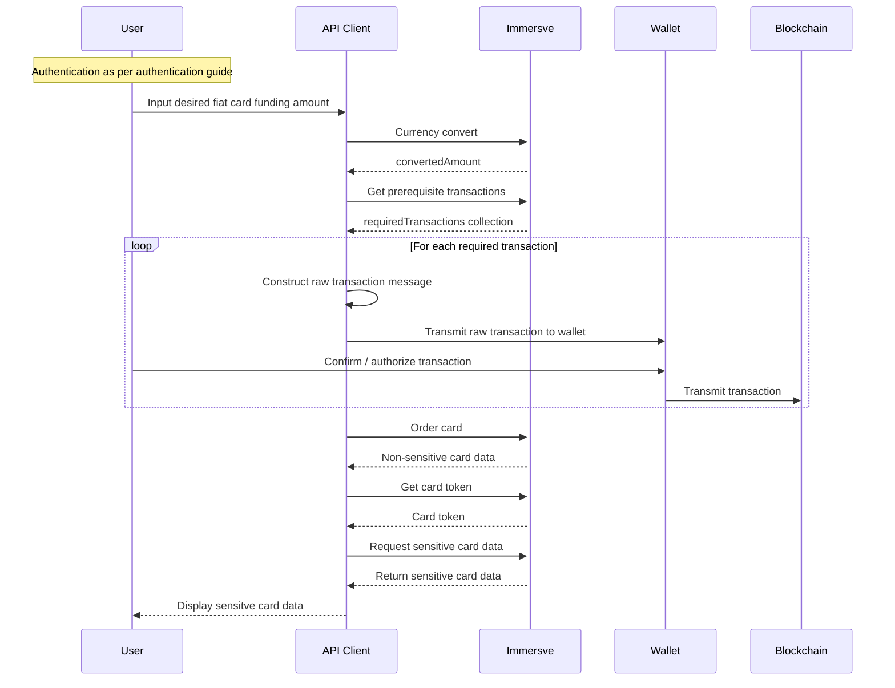

# Issue a Virtual Card

A virtual card is a payment card that exists only in digital form. As such, virtual cards are most suitable for online e-commerce purchases as opposed to in-store purchases at brick-and-mortar merchants. Immersve treat virtual cards as being logically time-bound and ephemeral. Beginning at the time of issuance of a virtual card, it has a finite useable lifespan which is often represented within the UI of the issuing client application as a stopwatch-type timer. This model presents certain benefits over a traditional persistent payment card model (be they virtual, tokenized or physical) in that the potential for card fraud is dramatically reduced. The use of web3-native authentication mechanisms within the context of card issuance mean that the same level of protection to a user's funds in self-custodial wallets is applied to their activities as a cardholder.

Prior to being permitted to [order a card](/api-reference/order-card) a user must first have successfully [authenticated](/guides/non-custodial%20wallets/authentication) and locked digital assets within the smart contract via digital asset transfer and smart contract invocations as instructed by the [get prerequisite transactions](/api-reference/get-prerequisites) operation.

## Authentication

The authentication processes is described in the [authentication guide](/guides/non-custodial%20wallets/authentication). As the user account is anchored by control of the private key, there is no distinct prior explicit registration or signup process needed before authenticating.

## Currency Conversion

A user will more often than not be quoted a price for a purchase by a merchant in a fiat currency. In order to determine the sufficient amount of digital assets to fund a card and be made available for the purchase, you will retrieve the amount from the [currency conversion](/api-reference/currency-conversion) API endpoint.

## Lock Funds

In order to ensure that funds are sufficiently locked within the [smart contract](/contracts/payment-protocol) such that Immersve are in a position to approve an authorization request received via the card scheme network you will need to have firstly locked sufficient digital assets within the smart contract via digital asset transfer and smart contract invocations as instructed by the [get prerequisite transactions](/api-reference/get-prerequisites) operation. The necessary blockchain transactions are contained within the `requiredTransactions` collection returned.

If the user has not transacted using the solution before then the the [get prerequisite transactions](/api-reference/get-prerequisites) response will typically call for and `erc20_approval` in favour of the smart contract followed by a `depositAndCreateLockedFund` invocation of the smart contract.

If multiple transactions are present then they should be carried out in the order in which they are presented.

The client application is to parse and formulate the raw blockchain transaction message such that it is presented to the user within the web3 wallet and signed and sent to the relevant blockchain.

### Wallet Funding for Development and Testing

To ensure that integrators are able to obtain sufficient ERC-20 tokens to facilitate development and testing, Immersve uses an ERC-20 token contract that allows tokens to be freely minted as needed.

In non-production environments any `erc20_approval` transaction type returned by [get prerequisite transactions](/api-reference/get-prerequisites) will refer to the "IMMUSDC" token. The "IMMUSDC" token has a `mint` function allowing for the unlimited minting of the token to any wallet address.

One particularly convenient way to get the necessary tokens is to use the Polygonscan interface.

- Open the [IMMUSDC token in Polygonscan](https://mumbai.polygonscan.com/address/0x2FaC06acFAeB42CC3B5327fcF53F48D9Da72749d#code)
- Click `Write as Proxy`
- Click `Connect to Web3` to connect your wallet with Polygonscan
- Open the `mint` function
- Set the destination wallet address (where assets are to be sent) in the `to` field. Set an amount in the `amount` field.
- Initiate the web3 transaction clicking the `Write` button
- Confirm the transaction in the web3 wallet and pay the gas fees

## Order a Card

With the funds locked in the smart contract, it's now time to order a card.

Call the [order a card](/api-reference/order-card) operation to request Immersve to generate a card.

The returned card data returned in response to a [order a card](/api-reference/order-card) request includes only truncated or masked sensitive data. Single-use virtual cards are activated and ready to use by default.

## Issue a Card

Having created an virtual card via the [order a card](/api-reference/order-card) operation, you are in a position to be able to obtain the sensitive card details to be presented to the cardholder.

There are two steps in this process;

1. firstly, obtaining a token for transmission to the client application to which the card details are to be provided (i.e. the application that will display the card data to the cardholder) and;
2. secondly, the exchange, by that client application, of the token for the card data.

:::note
It is not recommended that the card token is supplied to any application other than one that resides within the cardholder environment (i.e. their mobile application or web application running in their browser) unless that system is sufficiently compliant with PCI-DSS requirements and is audited as such.
:::

### Get a Card Token

Generate a single-use card `token` using [the get a card token](/api-reference/get-a-card-token) operation. The token is typically then transmitted to the cardholder's environment (i.e. web application or mobile application running in their web browser) to complete the final step completing the card issuance.

### Get Card Details

To obtain the full PAN and CVV2 for display to the cardholder your client-side application should exchange the token for the sensitive card data via the [get secure card details](/api-reference/get-secure-card-details) operation.

## Virtual Card Issuance Sequence Diagram

