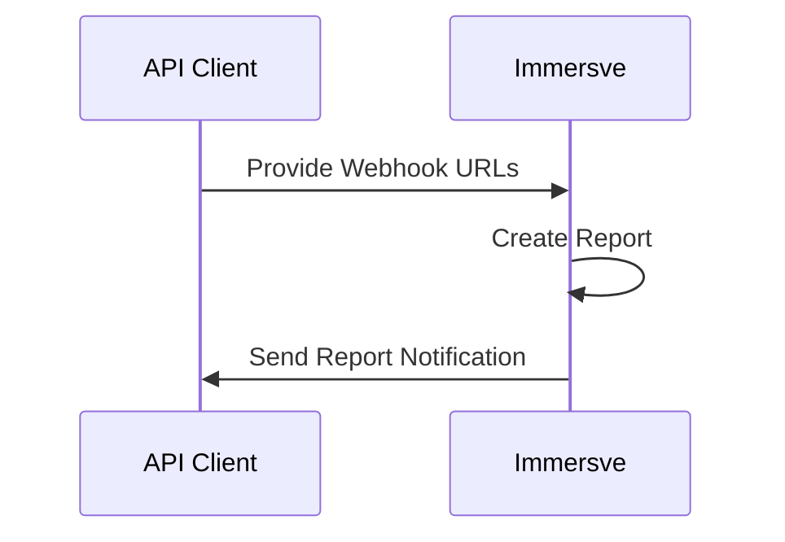

# Introduction

Immersve can generate [transaction](/api-reference/transactions) reports for a given card program over a time period that suits your needs.

Once a report is generated, Immersve will send a notification to a webhook that you provide. The notification will contain a URL to access your report.

The report is in CSV format. The file will be in the format `{reportId}_{reportType}_{startDate}_{endDate}.csv`. `reportId` is the unique identifier for the report. `startDate` and `endDate` represent the period the report is for.

