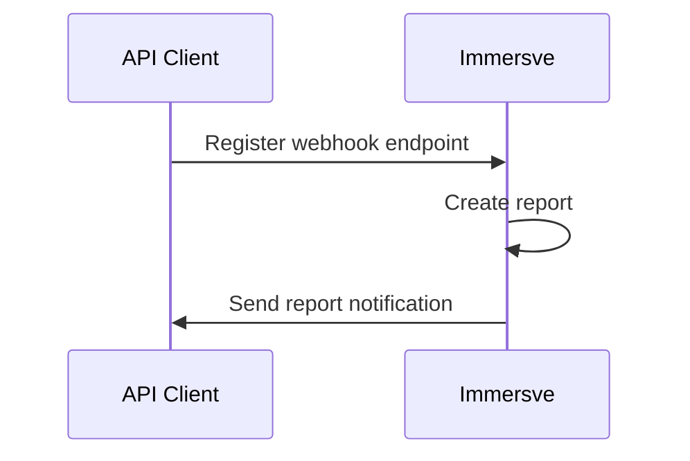

# Introduction

Immersve can generate [transaction](/api-reference/transactions) reports for a given card program over a time period that suits your needs.

Once a report is generated, Immersve will send a notification to your [webhook](/guides/webhooks) endpoint.

## Notification

Notifications to your [webhook](/guides/webhooks) endpoint will have the following payload.

|  Field   |                         Description                         |
| -------- | ----------------------------------------------------------- |
| reportId | Unique identifier of the report.                            |
| url      | URL to access the report. The URL will be valid for 7 days. |
