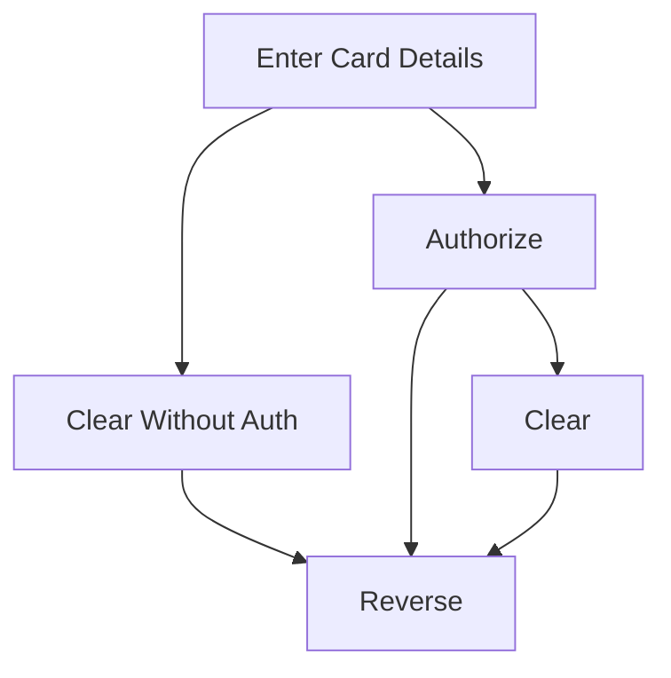

# Introduction

The simulator app is a test application that enables use of Immersve cards with a fake merchant.

To begin using the simulator, one must first create an Immersve card at [app.immersve.com](https://app.immersve.com). This app will prompt you to
use metamask to load test funds onto a short lived card. Once this card has been generated, navigate to the simulator app 
at [app.immersve.com/simulator](https://app.immersve.com/simulator). 

**NOTE:** You must stay logged into your Immersve account while using the simulator.

Once on the simulator app, you will be given a form to enter your card details into, as well as a series of options as indicated
by the flow diagram below.

At any point the `reset` button can be used to restore the application to its initial state, not maintaining any previous transaction history.
