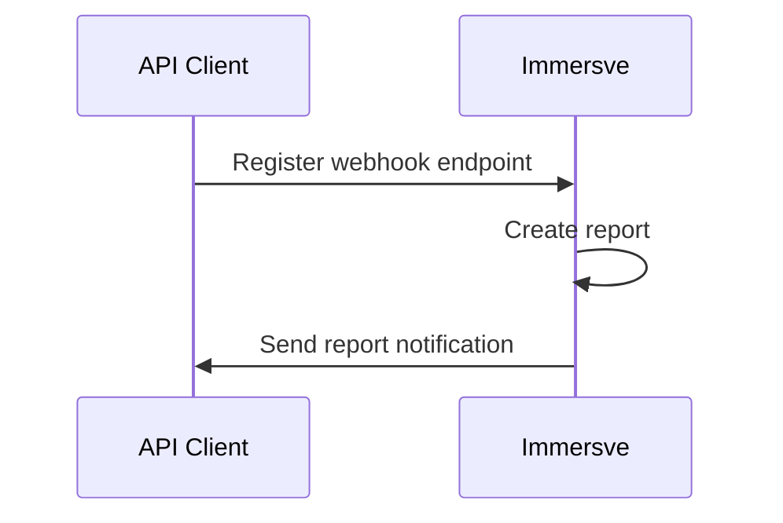

# Introduction

Immersve can generate reports for a given card program over a time period that suits your needs.

The report is in CSV format.

- The file name format is `{reportId}_{reportType}_{startDate}_{endDate}.csv`
- `reportId` is the unique identifier for the report.
- `reportType` is the type of report. Valid values are [authorization](/guides/reports/authorization-reports) or [clearing](/guides/reports/clearing-reports).
- `startDate` (inclusive) and `endDate` (exclusive) represent the time period being reported on.

Once a report is generated, Immersve will send a notification to your [webhook](/guides/webhooks) endpoint.

## Notification

Notifications to your [webhook](/guides/webhooks) endpoint will have the following payload.

|  Field   |                         Description                         |
| -------- | ----------------------------------------------------------- |
| reportId | Unique identifier of the report.                            |
| url      | URL to access the report. The URL will be valid for 7 days. |
